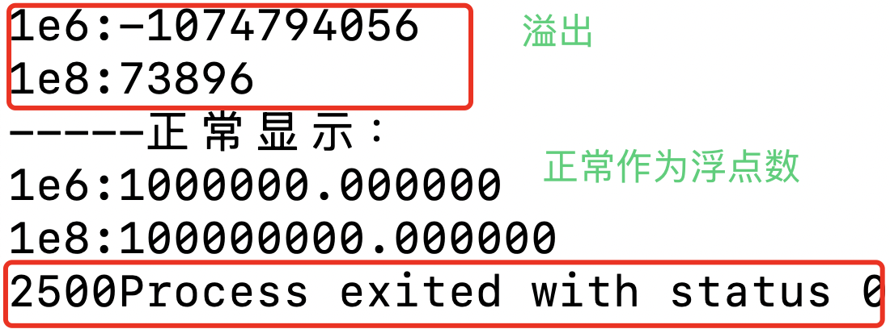
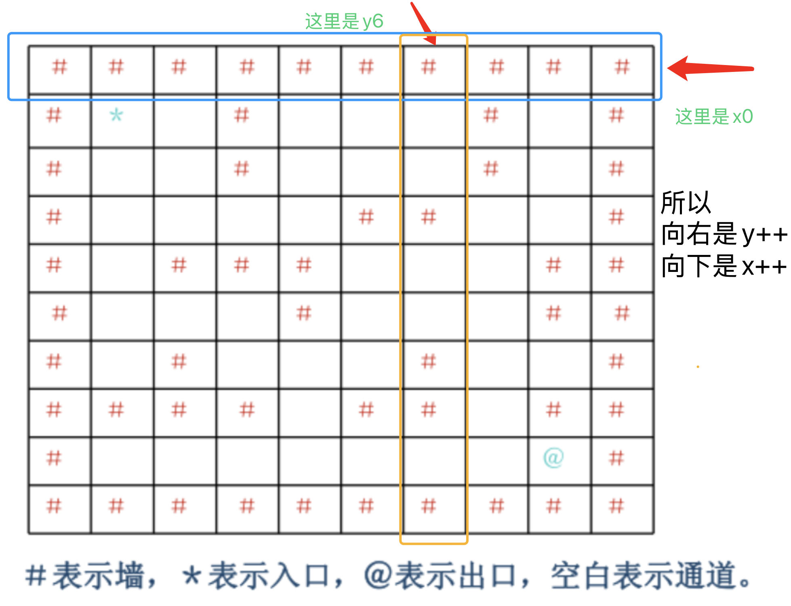

### 拓扑排序
拓扑排序的入队前提是当前节点的领结节点入度为0，所以判断入队的语句应当写成：
```cpp
for(int i=1;i<=n;i++) {
if(graph[node][i]==1 && --InDegree[i]==0) //只有在这个时候才能入队，也就是说在当前节点的邻接节点为0的时候才能进行入队！！  
{
    q.push(i);
}   
```

### 关键路径
这种题要小心测试数据输入一个start-end-0的测试样例打的你措手不及
所以一定要事先对graph数组(用于存储start-end的时间的数组)进行初始化
```cpp
for(int i=0;i<n;i++)
{
    for(int j=0;j<n;j++)
    {
        graph[i][j]=-1;
    }
}
```

### 图的深度优先搜索

图的深度优先搜索的基本思路是将某个节点的那条路走完
所以就是如果节点A-B有edge，那么递归遍历B、
```cpp
void DFS(int visited,int node,int n)
{
    visited[node]=1;
    for(int i=0;i<n;i++)
    {
        if(graph[node][i]== 1 && visited[i] == 0) DFS(visited,i,n);
    }
}
```
将当前节点设置成为被访问过的状态->遍历node的所有还没被访问过的邻接点->深度遍历这个邻接点
### 图的广度优先搜索

广度优先遍历的visited设置一定要在入队的时候，因为可能存在多条边的情况导致重复入队

```cpp

for(int i= 0;i<n;i++)
{
    if(visited[i]==0)
    {
        cout<<"{ ";
        q.push(i);
        visited[i]=1;
        while(q.size()!=0)
        {
            int node = q.front();
            q.pop();
            cout<<node<<" ";
            for(int j = 0;j<n;j++)
            {
                if(visited[j]==0 && graph[node][j]==1)
                {
                    q.push(j);
                    visited[j]=1;
            //广搜已访问的节点一定要在这里进行标记，否则下一个进来的节点如果还是与j相关的j就会重复队！！！
                }
            }
        }
        cout<<"}"<<endl;
    }
}
```

### 格式化输出%
```cpp
printf("%%")
```
->将会输出一个%

### 图中各种算法及其作用
| 算法名称 | 作用 |
|----------|----------|
| Prim | 选点法求**联通所有点**的最短带权路径 |
| Kruskal | 选边法求**联通所有点**的最短带权路径 |
| dijkstra| 求单一源点到汇点的最短连通路径 |
| Floyd| 求任意源点到汇点的最短连通路径 |
| Row 5, C1 | Row 5, C2 |
| Row 6, C1 | Row 6, C2 |


### Prim算法
Prim算法的核心是
```cpp
dist[j]=min(dist[j],g[j][min_point])
```
dist表示的是j节点到当前的最小生成树的距离，也就是说只是距离
每次增加一个新的节点到路径里面，如果这个节点导致了A到最小生成树的路径变短那么就要更新这个距离，但不是用g[j][min_point]+dist[min_point]
用脑子想一下，dist是到当前最小生成树的距离，再加上g[j][min_point]，不就相当于到`没加入min_point之前`的那个最小生成树的最短距离了。所以不是这么更新的。

### Prim算法和dijkstra 算法的区别
其实差别不大，但是在dist的意义发生了变化和获得答案的方式发生了变化
1.dist
在dijkstra 算法中dist是指当前点到源点的最短距离
而在Prim算法中dist是指当前点到最小生成树集合的最短距离
2.获得答案的方式
在dijkstra 算法中dist[target]就是答案
**而在Prim算法中需要对每次某点到最小生成树的距离进行累加**

### 旅游规划那道题的inf不要放太1e6因为1e6和1e8会溢出


### 求解迷宫的入口到出口的路线
1.要注意dx和dy的使用，因为我们是默认二维数组的第一维为x，第二维为y，所以向右应该是第二维数组的符号变化
换句话来说，向右是y++,向下是x++

2.**注意回溯的问题**要在回溯之前就判断是否到达路线，如果不是那么回溯修改线路
```cpp
int dfs(int x,int y,int n)
{
    pos* position =new pos;
    position->x=x;
    position->y=y;
    path.push_back(*position);
    visited[x][y]=1;
    if(visited[n-2][n-2]==1) return 1;
    for(int i=0;i<4;i++)
    {
        int x_pos=x+dx[i];
        int y_pos=y+dy[i];
        if(x_pos<n && x_pos>0 && y_pos<n && y_pos>0 && maze[x_pos][y_pos]!=1 && visited[x_pos][y_pos]==0)
        {
            if(dfs(x_pos,y_pos,n)) return 1;
            visited[x_pos][y_pos]=0;
            path.pop_back();
        }
    }
    return 0;
}
```

**核心语句就是**
```cpp
if(x_pos<n && x_pos>0 && y_pos<n && y_pos>0 && maze[x_pos][y_pos]!=1 && visited[x_pos][y_pos]==0)
{
    if(dfs(x_pos,y_pos,n)) return 1;
    visited[x_pos][y_pos]=0;
    path.pop_back();
}
```

### 栈的使用
在栈中取值之前或者说在对栈进行任何操作（除了入栈）
top --、vector.at(vector.size()-1)
都要对栈的合法性进行判断也就是要判断栈是否为空

### 对于像彩虹瓶这种需要**一口气输入所有输出并重复判断的题**
**不要有结果了就直接返回不管别的数据点**，即使有结果了也要吧剩下的数据点读完，不然会导致没读的数据点影响下一次的判断
**比如这次输入有7个**但是在读入6个的时候就停止判断和读如会导致这一组的最后一个数据影响下一次的判断


### 最长连续递增子序列-〉对默认情况的处理
注意max_len的初始化应当为1而不是-1，因为如果是-1的话那么就相当于认为第一个数字不是最长的。
也就是说，在初始化的时候认为`max_index=0`应当对应起来`max_len=1`;


### 后缀表达式求值(超级多细节)
1.对输入的处理
```
5 -2 + 3 * #
```
也就是说输入的有正整数、负整数和字符的混合体，也就是说如果按照char输入的话就会对负数处理出现失误、如果按照int输入的话就无法处理运算符
**因此最佳的处理方式是string**
然后利用string函数
`to_string()`转化为string
`stoi()`转化为int类型

2.对输入的比较，由于输入是存在**负数**
所以不能判断0<=input<=9,而应该判断输入是否为运算符，否则入栈

3.对栈的处理
由于这里是需要读取站顶元素，所以要先读再top--
所以不能写成**a=stacks[--top]应该写成a=stacks[top--]**


### string的使用
1.
`to_string()`转化为string
`stoi()`转化为int类型
`s.size()`获取string的大小
2.
sting是可以直接进行比较的比如说
```cpp
input == "-"
```
是正确是输入方式

3.再sting后面加入新元素和**py**的处理方式差不多，直接+=即可
```cpp
string error_massege;
error_massege="Error: ";
error_massege += to_string(b);
error_massege+="\\";
error_massege += "0";
```
4.对string的随机访问
s.at()或者s[]
### 完美二叉树的层序遍历
```cpp
#include<iostream>
using namespace std;
const int max_size=31;
int PostOrder[max_size];
int res[max_size];
int n;
int idx;

void postorder(int root){
    if(root>n){
        return ;
    }
    postorder(root*2);
    postorder(root*2+1);
    res[root]=PostOrder[idx++];
}
int main(){
    cin>>n;
    for(int i=0;i<n;i++){
        cin>>PostOrder[i];
    }
    postorder(1);
    for(int i=1;i<=n;i++){
        if(i!=n) cout<<res[i]<<" ";
        else cout<<res[i];
    }
    return 0;
}
```
1.
**完全二叉树的顺序存储和层序存储才满足2\*i与2\*i+1的关系**
不是先序遍历哈！！！

2.通过模拟后序遍历的插入逻辑将值插入ans中即可   
```cpp
void postorder(int root){
    if(root>n){
        return ;
    }
    postorder(root*2);
    postorder(root*2+1);
    PostOrder[i]=data;
}
```
这个是插入过程⬆️
模拟这个插入过程在**root的位置插入放好的PostOrder值**就好啦


### deque的使用
deque是一个双入双出的队列而queue是一个单入单出的队列，相比而言deque的使用范围更广，而且有随机访问的函数 `.at()`
`q.push_back()`
`q.push_front()`
`q.pop_back()`
`q.pop_front()`
`q.at(i)`
`q.back()`
`q.front()`
**deque和queue**的内存占用会比vector大很多哈，如果超限了就要改为**vector**
### make_heap的使用
make_heap是用于建立一个堆的代码依赖在`algorithm`，为了实现堆维护，还需要增加`vector`和`functional`
```cpp
#include<vector>
#include<functional>
#include<alogrithm>
```
将初始数组放在vector中
利用make_heap和greater<int>()实现构建一个小根堆
```cpp
make_heap(v.begin(),v.end(),greater<int>())
```
make_heap默认生成一个大根堆
```cpp
make_heap(v.begin(),v.end())
```
pop_heap(v.begin(),v.end(),greater<int>())会将堆顶元素放置vector末尾并自动维护好堆
所以取出堆顶元素的操作是
```cpp
pop_heap(v.begin(),v.end(),greater<int>());
int a =v.back();
v.pop_back();
```
插入元素就是在最后面push_back()然后重新维护一边就好了
```cpp
v.push_back(new_value);
make_heap(v.begin(),v.end(),greater<int>());
```

### 交换二叉树中的左子树和右子树
从上到下进行交换就行了
```cpp
void Myswap(TNode * root)
{
    if(root== nullptr) return ;
    swap(root->left,root ->right);
    TNode(root->left);
    TNode(root->right);
}
```

### unordered_map
```cpp
#include<unordered_map>
```
```cpp
unordered_map<string,string> map;//创建一个新的unorded_map
map.count(i)//寻找是否存在这个键，如果存存在>0否则<=0
map[key]=values;//创建新的键值对
map.erase(key);//删除这个键值对
```
**操作上和py的字典很像**不能不存两个相同的键。

### 堆排序的维护函数中i不是++遍历而是*2遍历
```cpp
void HeapAdjust(int k,int len)
{
    A[0]=A[k];
    for(int i=k*2;i<=len;i*=2)
    {
        if(i<len && A[i] < A[i+1] ) i++;
        if(A[0]<A[i])
        {
            A[k] = A[i];
            k=i;
        }
        else
        {
            break;
        }
    }
    A[k]=A[0];

}
```

### 在向量vector中放置结构体
```cpp
typedef struct Person {
    string id;
    int de;
    int cai;
    int total;
} Person;

vector<Person> class1, class2, class3, class4; //初始化
class1.push_back({id, de, cai, de + cai});     //加入元素
```
### 用sort函数对vector进行排序
```cpp
#include<algorithm>
#include<functional>
sort(v.begin(),v.end(),greater<int>())
```

### 稀疏矩阵加法要注意处理和为0的情况

### 是否为同一二叉搜索树

比较树的方法是，让比较的序列的每一个元素去走一遍那颗树，直到找到**相同值得那个节点**。如果途中经过某一个之前没有访问过节点，并且这个节点的值和这个元素的值不相同，那么就可以判定这两组序列所构造的树不是同一颗二叉搜索树，之后的元素不再需要走这颗树了。

**所以核心思路是走一遍二叉搜树并记录flag**


### 使用setfill、setwidth、setprecision对输出进行格式化
1.先导0
```cpp
cout<<setfill('0')<<setw(10)<<num;
```
2.对浮点数四舍五入
```cpp
cout<<setprecision(2)<<num;
···
